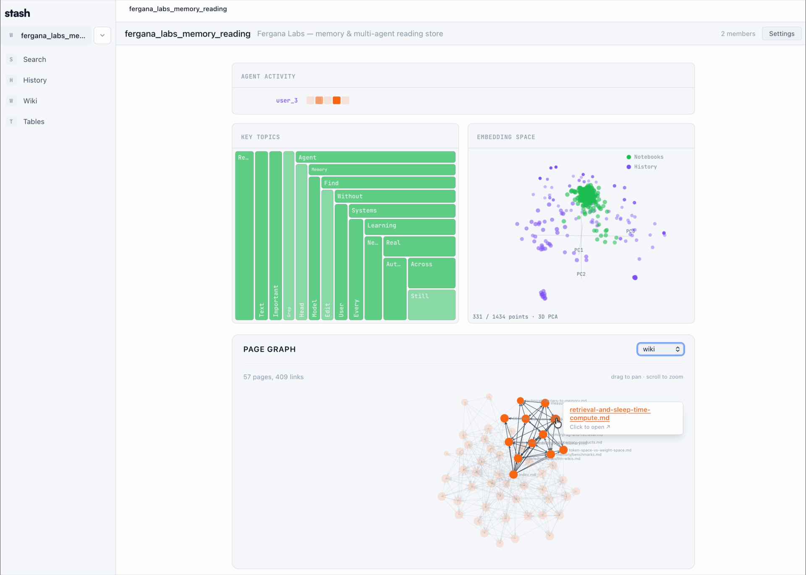
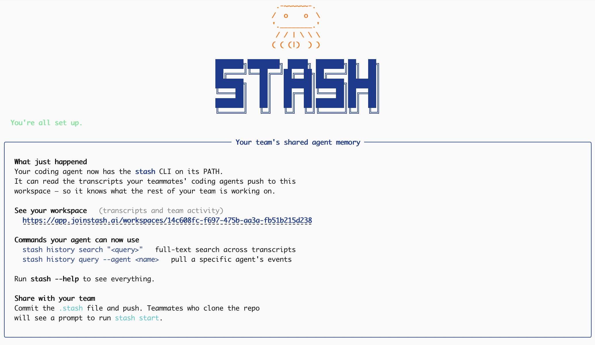

<p align="center">
  <a href="https://joinstash.ai"></a>
</p>

<h3 align="center">Your team's AI work, compounding.</h3>

<p align="center">
  Stash captures every coding-agent run across your team and turns<br/>
  it into a shared, evolving asset every agent can build on.
</p>


<p align="center">
  <a href="https://github.com/Fergana-Labs/stash/actions/workflows/test.yml"></a>
  <a href="LICENSE"></a>
  <a href="https://joinstash.ai"></a>
  <a href="#self-hosted"></a>
  <a href="#privacy"></a>
</p>
<p align="center">
  When every agent run feeds the same shared asset, your team stops paying for the same investigation twice.<br/>
  When we tested this internally, we found that it sped up Claude Code's root cause analysis by <a href="https://henrydowling.com/agent-velocity.html"><b>46%</b></a>.<br/>
</p>


<!-- GIF #1 — Visualizations of the workspace knowledge base -->
<p align="center">
  
</p>
<!-- GIF #2 — The product in action: agent runs `stash history search`, gets a cited answer -->

<p align="center">
  
</p>

## Table of Contents

- [Why shared beats individual](#why-shared-beats-individual)
- [How it works](#how-it-works)
- [Quick Start](#quick-start)
- [Integrations](#integrations)
- [CLI](#cli)
- [Self-Hosted](#self-hosted)
- [Privacy](#privacy)
- [FAQ](#faq)
- [Contributing](#contributing)
- [License](#license)

## How it works

Stash installs a hook for your coding agents that automatically uploads session transcripts to a shared store. Then, it exposes a CLI that allows you and your teammates to query this shared store. Stash automatically builds a Karpathy-style wiki on top of the set of session transcripts to make it easier for your coding agents to query its contents.

## Why shared beats individual

When five engineers run Claude on the same repo, five different versions of "what we learned" live in five different machines. Nothing compounds. As a result, engineering effort is duplicated and eng velocity is decreased. This is especially true as coding agents begin to run autonomously for significant periods of time. Stash is the missing layer: every run becomes part of a shared, evolving asset the whole team, and every agent, can query.

With Stash, every agent on the repo can ask (and answer):

- *"Why did Sam bump the rate limit from 100 to 500?"*
- *"Has anyone already tried fixing the memory leak in auth?"*
- *"What pattern did we land on for background workers last sprint?"*

> "raw data from a given number of sources is collected, then compiled by an LLM into a .md wiki, then operated on by various CLIs by the LLM to do Q&A and to incrementally enhance the wiki… **I think there is room here for an incredible new product instead of a hacky collection of scripts.**"
>
> — Andrej Karpathy, *LLM Knowledge Bases*

**Stash is that product. For teams of coding agents working on the same repo.** Your agents' streamed sessions are the raw data. The wiki is curated automatically by our sleep agent. Everything lands in one workspace your whole team can query. AI usage becomes a shared, evolving asset, not individual effort.

## Quick Start

One line installs the CLI, signs you in, picks a workspace, and installs plugins for your coding agent (auto-detects Claude Code, Cursor, Codex, and OpenCode):

```bash
bash -c "$(curl -fsSL https://raw.githubusercontent.com/Fergana-Labs/stash/main/install.sh)"
```

<p align="center">
  
</p>

Then try it: ask your coding agent if it has access to Stash.

## Integrations

Stash supports the following coding agents:
- **Claude Code** 
- **Cursor** 
- **Codex** 
- **OpenCode**
- **Gemini CLI**
- **Openclaw** 

Stash supports opt in per-coding agent. Every plugin streams session activity to the same workspace and gives the agent access to the shared `stash` CLI. Mix and match — different teammates can use different agents against the same shared brain.

## CLI Reference

See here for a CLI reference: https://www.joinstash.ai/docs/cli

## Self-Hosted

```bash
git clone https://github.com/Fergana-Labs/stash.git
cd stash
cp .env.example .env          # fill in credentials + API keys
# edit Caddyfile → replace app.example.com with your domain
docker compose -f docker-compose.prod.yml up -d
```

Brings up four containers: PostgreSQL 16 + pgvector, FastAPI backend (`:3456`), Next.js frontend (`:3457`), and Caddy for automatic HTTPS via Let's Encrypt. Alembic migrations run on backend startup.

Embeddings default to local sentence-transformers — no API keys required to run. Set `EMBEDDING_PROVIDER` to switch to OpenAI, Hugging Face, or any OpenAI-compatible endpoint. Optional S3-compatible object storage (R2, S3, MinIO) for file uploads.

> Local development? Use `docker compose up -d` (no `-f` flag) — simple setup with hardcoded dev credentials.

## Privacy

Stash is built for engineering teams working in private repos.

- **No LLM calls from the server.** Curation and search run inside your agent (Claude Code, Cursor, etc.) using the keys it already has. The Stash backend itself makes no model calls.
- **Permissioned workspaces.** Only invited members can access a workspace. Public visibility is per-resource.
- **Transcripts are opt-in.** If you don't want to share your agent trasncripts, you can give your agent shared *read* access to the workspace's memory without uploading any of your own session data.
- **Self-hostable end-to-end.** You can get the whole thing running on your infra with a single docker compose, and then optionally pass in an API key of your choice to power embeddings.

## FAQ

**What LLMs does Stash use?**
None on the server. Curation runs inside your agent (Claude Code, Cursor, etc.) as a plugin skill, so it uses whatever model and keys the agent is already configured with — the Stash backend itself makes no LLM calls. Embeddings are pluggable and default to local sentence-transformers (no key). Set `EMBEDDING_PROVIDER` in `.env` to switch to OpenAI, Hugging Face, or any OpenAI-compatible endpoint.

**Can I use this without Claude Code?**
Yes. The CLI and REST API work standalone with any client, and there are first-party plugins for Cursor, Codex, OpenCode, Gemini CLI, and Openclaw.

**Where does the "save up to 46%" number come from?**
A 4-session memory-leak benchmark documented in [*On Agent Velocity*](https://henrydowling.com/agent-velocity.html) by Henry Dowling (one of Stash's maintainers). Without transcript sharing, nearly half of agent actions re-investigated fixes earlier sessions had already tried and ruled out. With shared transcripts, wasted work dropped ~97% and tool calls dropped ~50%.


## Contributing

Contributions are welcome. See [CONTRIBUTING.md](CONTRIBUTING.md) to get started.

Found a bug? [Open an issue](https://github.com/Fergana-Labs/stash/issues).

## License

[MIT](LICENSE) — Copyright (c) 2026 Fergana Labs

---

<p align="center">
  Built by <a href="https://ferganalabs.com">Fergana Labs</a>.
</p>
