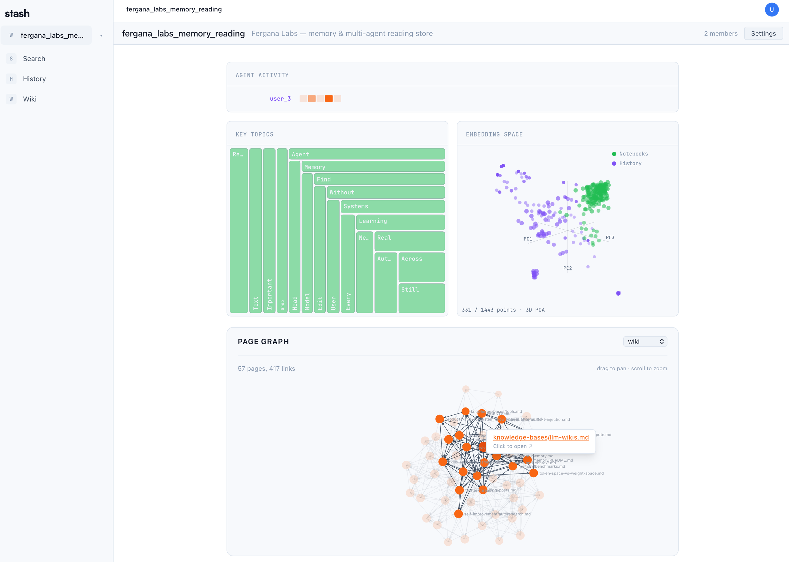

<p align="center">
  
</p>

<h3 align="center">Agent memory for your repos.</h3>

<p align="center">
  Stash is the hive mind for your team's coding agents. Every session, decision,<br/>
  and search flows into one shared brain — so the next agent that touches your<br/>
  repo already knows what's been learned.
</p>

<p align="center">
  <a href="https://github.com/Fergana-Labs/stash/actions/workflows/test.yml"></a>
  <a href="LICENSE"></a>
  <a href="https://joinstash.ai"></a>
</p>

<p align="center">
  
</p>

## Table of Contents

- [Why Stash](#why-stash)
- [How it works](#how-it-works)
- [Quick Start](#quick-start)
- [CLI](#cli)
- [Integrations](#integrations)
- [Self-Hosted](#self-hosted)
- [Documentation](#documentation)
- [FAQ](#faq)
- [Contributing](#contributing)
- [License](#license)

## Why Stash

Every coding agent on your team starts from zero. Your agent just debugged a flaky auth test — an hour later, a teammate's agent hits the same test and starts from scratch. Multiply that across a week and half the team is reinventing the same fixes.

Stash gives every agent on the repo a shared memory, so they can ask (and answer) questions like:

- *"Why did Sam bump the rate limit from 100 to 500?"*
- *"Has anyone already tried fixing the memory leak in auth?"*
- *"What pattern did we land on for background workers last sprint?"*

## How it works

**Stream → Curate → Search.** Three loops running over a shared workspace:

1. **Stream** — Prompts, tool calls, and session summaries push to the workspace's history as they happen. Nothing to remember to save.
2. **Curate** — On `SessionEnd`, a curation agent reads recent history and organizes it into wiki notebooks with `[[backlinks]]` and a page graph. Sleep-time compute, not session time. Auto-runs with a 24h cooldown; trigger manually with the `/curate` slash command.
3. **Search** — `stash search` runs a cross-resource agentic loop over files, history, notebooks, tables, and chats. Your agent answers with sources, not hallucinations.

## Quick Start

One line installs the CLI, signs you in, picks a workspace, and installs the Claude Code plugin (if detected):

```bash
bash -c "$(curl -fsSL https://raw.githubusercontent.com/Fergana-Labs/stash/main/install.sh)"
```

Then try it:

```bash
stash history search "authentication patterns"      # Full-text search over events
stash history push "session notes here"             # Push an event
stash --help                                        # Full command list
```

<details>
<summary>Manual install</summary>

```bash
pipx install stashai        # or: uv tool install stashai
stash connect               # Interactive: sign in, pick a workspace, install plugin
```

</details>

## CLI

```bash
stash connect                        # Configure API key + default workspace
stash history push <content>         # Push an event
stash history search <query>         # Full-text search over history events
stash notebooks list --all           # List notebooks across your workspaces
stash --help                         # Full command list
```

Every command accepts `--json` for machine-readable output and `--ws ID` to target a specific workspace. Full reference at [joinstash.ai/docs/cli](https://joinstash.ai/docs/cli).

## Integrations

Stash works with Claude Code, Cursor, Codex, OpenCode, and Openclaw. The installer auto-detects whichever you have and wires up the plugin.

### Claude Code plugin

The [`plugins/claude-plugin`](plugins/claude-plugin/README.md) directory ships a Claude Code plugin that turns any session into a persistent Stash agent: activity streams to history, memory injects into every prompt, and context carries across sessions.

The [Quick Start](#quick-start) one-liner installs the plugin automatically when it detects Claude Code. To do it manually:

```bash
pipx install stashai                                    # or: uv tool install stashai
claude plugin marketplace add Fergana-Labs/stash
claude plugin install stash@stash-plugins
stash connect                                           # Sign in + pick a workspace
```

Everything is a `stash` CLI subcommand — there are no slash commands beyond `/curate` (manual curation trigger) and `/stash:welcome` (re-prints the post-install message). See the [plugin README](plugins/claude-plugin/README.md) for full setup.

## Self-Hosted

```bash
git clone https://github.com/Fergana-Labs/stash.git
cd stash
cp .env.example .env          # fill in credentials + API keys
# edit Caddyfile → replace app.example.com with your domain
docker compose -f docker-compose.prod.yml up -d
```

Brings up four containers: PostgreSQL 16 + pgvector, FastAPI backend (`:3456`), Next.js frontend (`:3457`), and Caddy for automatic HTTPS via Let's Encrypt. Alembic migrations run on backend startup.

Embeddings default to local sentence-transformers — no API keys required to run. Set `EMBEDDING_PROVIDER` to switch to OpenAI, Hugging Face, or any OpenAI-compatible endpoint. Optional S3-compatible object storage (R2, S3, MinIO) for file uploads.

> Local development? Use `docker compose up -d` (no `-f` flag) — simple setup with hardcoded dev credentials.

## Documentation

| Document | What it covers |
|----------|---------------|
| [Quickstart](https://joinstash.ai/docs/quickstart) | Install the CLI, connect your agent, push your first events |
| [Concepts](https://joinstash.ai/docs/concepts) | Workspaces, history, notebooks, tables, files, search, curation |
| [CLI](https://joinstash.ai/docs/cli) | Every command, every flag |
| [Self-hosting](https://joinstash.ai/docs/self-hosting) | Full Docker Compose deploy with environment reference |
| [Architecture](ARCHITECTURE.md) | System diagram, data model, backend/frontend structure |
| [Use Cases](USE_CASES.md) | End-to-end scenarios — team KB, research, multi-agent |
| [Contributing](CONTRIBUTING.md) | Local dev setup, running tests, submitting PRs |
| [Design System](DESIGN.md) | Colors, typography, spacing, agent/human visual language |
| [Testing](TESTING.md) | Test frameworks, suites, conventions |
| [Security](SECURITY.md) | Vulnerability reporting policy |
| [Changelog](CHANGELOG.md) | Release history |

## FAQ

**What LLMs does Stash use?**
None on the server. Curation and agentic search run inside your agent (Claude Code, Cursor, etc.) as plugin skills, so they use whatever model and keys the agent is already configured with — the Stash backend itself makes no LLM calls. Embeddings are pluggable and default to local sentence-transformers (no key). Set `EMBEDDING_PROVIDER` in `.env` to switch to OpenAI, Hugging Face, or any OpenAI-compatible endpoint.

**Do I have to upload my transcripts?**
Transcript upload is opt-in. You can give your agent shared read access to the repo's memory without uploading anything from your own sessions.

**Can I use this without Claude Code?**
Yes. The CLI and REST API work standalone with any client, and there are first-party plugins for Cursor, Codex, OpenCode, and Openclaw.

**Is my data private?**
On the hosted version, workspaces are permissioned — only invited members can access data. For full control, self-host with Docker Compose and keep everything on your own infrastructure.

## Contributing

Contributions are welcome. See [CONTRIBUTING.md](CONTRIBUTING.md) to get started.

Found a bug? [Open an issue](https://github.com/Fergana-Labs/stash/issues).

## Maintainers

| Name | Role | Contact |
|------|------|---------|
| [@henry-dowling](https://github.com/henry-dowling) | Creator & Lead maintainer | GitHub issues or [support@ferganalabs.com](mailto:support@ferganalabs.com) for vulnerabilities |
| [@samzliu](https://github.com/samzliu) | Creator | GitHub issues |
| [@triobaba](https://github.com/triobaba) | Creator | GitHub issues |

## License

[MIT](LICENSE) — Copyright (c) 2026 Fergana Labs

---

<p align="center">
  Built by <a href="https://ferganalabs.com">Fergana Labs</a>.
</p>
