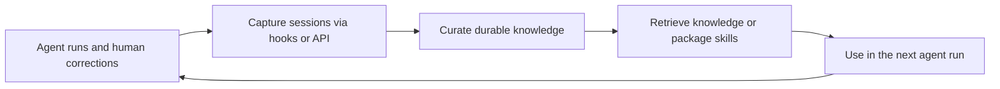
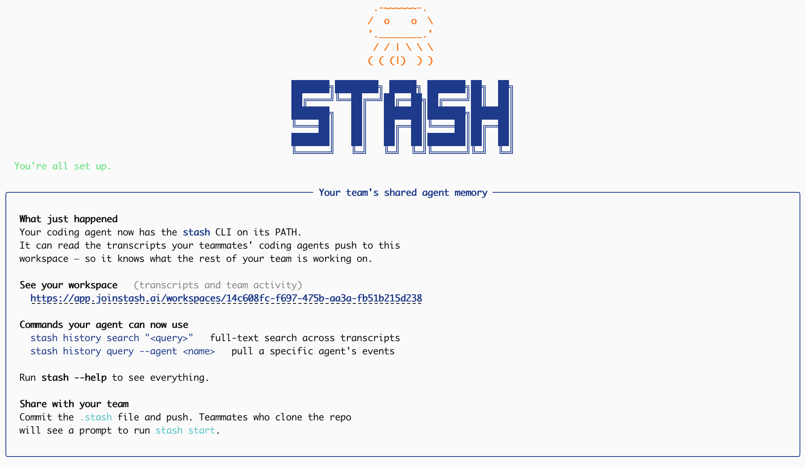
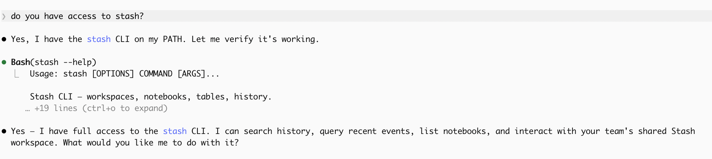

<p align="center">
  <a href="https://joinstash.ai"></a>
</p>

<h3 align="center">Help your agents learn from experience.</h3>

<p align="center">
  Agents generate valuable experience every time they work: successful approaches, <br>
  failed attempts, and human corrections. Stash captures that history and makes <br>
  its lessons available to future runs.
</p>


<p align="center">
  <a href="https://github.com/Fergana-Labs/stash/actions/workflows/test.yml"></a>
  <a href="LICENSE"></a>
  <a href="https://joinstash.ai"></a>
  <a href="#self-hosted"></a>
  <a href="#privacy"></a>
  <a href="https://discord.gg/PVFdcQx2u3"></a>
</p>

This repository provides the open-source foundation: trace collection, persistent
knowledge, and reusable skills, accessible through a [Python SDK](sdk/README.md),
REST API, MCP, and CLI. It works alongside your existing agents and models.


```mermaid
flowchart LR
    A[Agent runs and human corrections] --> B[Capture sessions via hooks or API]
    B --> C[Curate durable knowledge]
    C --> D[Retrieve knowledge or package skills]
    D --> E[Use in the next agent run]
    E --> A
```

Stash's broader work focuses on extracting reliable feedback signals from messy
production traces and using them to improve prompts, skills, and ultimately
model weights. The [reward-model product docs](https://www.joinstash.ai/docs)
cover trace annotation, reward-model training, and skill optimization with GEPA;
those training and optimization implementations are not included in this
repository. Our research direction is to make feedback extraction increasingly
automatic, starting from human labels.

## Reward models in action

The [product demo](https://www.joinstash.ai/docs) follows a refund-support agent
from reviewer feedback to a reusable skill. These screenshots use demo traces;
the displayed scores are from that example run.

**1. Give feedback on what the agent should have done.** Label a trace or step,
highlight the response, and explain the correction.

<!-- Frame from www/public/docs/demo/annotate.mp4 at 10 seconds. -->
<p align="center">
  
</p>

**2. Train a reward model from labeled traces.** Select examples with positive
and negative feedback to teach the model what reviewers prefer.

<!-- Frame from www/public/docs/demo/train.mp4 at 3 seconds. -->
<p align="center">
  
</p>

**3. Turn the reward signal into a skill.** GEPA uses the reward model and
reviewer comments to optimize instructions. Download the resulting `SKILL.md`
for your agent to use in future runs.

<!-- Frame from www/public/docs/demo/skill.mp4 at 20 seconds. -->
<p align="center">
  
</p>

## How it works

1. **Capture experience.** Hooks for coding agents record prompts, tool calls,
   and responses when session recording is enabled. Use the SDK or API to send
   events from your own agents.
2. **Extract durable lessons.** A scheduled curator reads new sessions and
   source material, then updates linked pages in your Memory wiki. The knowledge
   stays available after the original session ends.
3. **Make lessons reusable.** Agents search and read that knowledge through the
   CLI, MCP, API, or virtual filesystem. You and your agents can package related
   instructions and files into a Skill: a folder containing a `SKILL.md`.
4. **Carry them into future runs.** Install skills into your agent with
   `stash skills install`. Installed skills auto-update at session start, so
   changes to shared instructions can reach the next run without changing the
   underlying model's weights.

### Example: a correction becomes a reusable instruction

Illustrative workflow:

| Stage | What happens |
|---|---|
| **Trace** | An agent proposes a database migration. The reviewer points out that it would discard existing customer data. |
| **Durable lesson** | Record the project rule: schema changes must migrate existing data forward. |
| **Reusable skill** | Package a migration checklist that requires a data migration and verification that existing records survive. |
| **Next run** | The agent loads the checklist while planning another schema change. Reviewers check whether it applied the lesson. |

The output is inspectable knowledge and instructions that another agent can
read, use, and revise. Whether they improve results should be checked on
subsequent tasks.

In an [internal experiment](https://henrydowling.com/agent-velocity.html), we
measured a **49% speedup** for long-running Claude Code instances using Stash.
See the experiment for its setup and results.

## Quick Start

```bash
uv tool install stashai
stash signin
```

`stash signin` authenticates you in the browser, then walks first-run setup:
session recording (on by default — pause anytime with `stash stop`), which
coding agents to record, Stash instructions for the folder you're standing in
(any folder — a git repo isn't required), and a background import of the
conversations you've already had (`stash import-history --status` follows it
live). Re-run the wizard anytime with `stash setup`; use `stash connect` from
any other project folder to set it up for Stash.

<details>
<summary>Prefer a one-liner?</summary>

```bash
bash -c "$(curl -fsSL https://joinstash.ai/install)"
```

The installer uses `uv` to install or update `stashai`, bootstrapping `uv`
when needed, and then runs `stash signin`.
Use this when you don't already have a Python toolchain on your machine.

</details>

<p align="center">
  
</p>

Then try it: ask your coding agent if it has access to Stash.

<p align="center">
  
</p>

Agents can browse Stash with an app-level virtual filesystem shell:

```bash
stash vfs ls /
stash vfs "tree / -L 2"
stash vfs "find / -maxdepth 3 -type f | head -n 20"
stash vfs "rg \"database migration\" /"
```

## Shared workspace and tools

- **Files and sessions live side by side.** Markdown, HTML, tables, PDFs. You and your agents both write here; both sides see edits in real time.
- **Agents query it like a filesystem.** A CLI, MCP server, REST API, and virtual-filesystem shell expose your Stash to any agent. One search spans your pages, sessions, and every connected source at once.
- **Share skills across agents and teammates.** Publish a Skill, fork a public Skill into your own Stash, or use `stash skills follow` to auto-install skills people share with you.
- **Run agents with this context.** Chat with an agent in the app, from Slack, or from Telegram. It runs a coding-agent CLI (Claude Code, Codex, or opencode) on your own cloud VM. Give it a cron to schedule it.
- **Bring your own MCP servers.** Register MCP servers once (Tools page or `stash tools add`); your cloud agent gets them automatically and `stash tools install` writes them into any local agent's `.mcp.json`.

## Connected sources

Connect a source once and every agent you point at Stash can read and search it.

| Source | What lands in your Stash |
|---|---|
| **GitHub** | Repo contents, indexed for search — one repo, a pick-list, or every repo you can see |
| **Google Drive** | Your Drive, searchable by name and path; pick a folder to extract full contents (PDFs and scans included) |
| **Gmail** | Recent mail, with search federated live to Gmail. Multiple mailboxes supported |
| **Slack** | Messages from the channels you choose, filed as a transcript per channel per day |
| **Notion** | Pages and database rows as Markdown |
| **Linear** / **Jira** / **Asana** | Issues and tasks, indexed by team, project, or board section |
| **Granola** | Meeting notes and transcripts |
| **PostHog** | Dashboards, insights, feature flags, and experiments |
| **X** | Your bookmarks, posts, replies, and articles — with thread context and media archived |
| **Instagram** | Saved posts and reels, captured by the browser extension |

You can also drop in an **Obsidian vault**, and the **Chrome extension** adds a
web clipper, a bookmark importer, YouTube transcripts, and your ChatGPT and
Claude.ai conversations.

Slack and Linear push changes to Stash over webhooks; everything else syncs on a
schedule. Pick Slack's channels yourself — nothing is indexed until you do.

## Coding agents

Stash supports the following coding agents:
- **Claude Code** 
- **Cursor** 
- **Codex** 
- **OpenCode**
- **Gemini CLI**
- **Openclaw** 
- **Hermes**

Stash supports opt in per-coding agent. `stash signin` detects every agent on your machine and auto-installs its hooks — pick which ones during signin. Mix and match — different teammates can use different agents against the same shared brain. (Openclaw's code scanner requires its unsafe-install flag, which the installer passes; Hermes asks you to approve the hooks once via `hermes hooks list`.)

## CLI Reference

Run `stash --help`, or `stash <command> --help` for any command.

## Self-Hosted

Run Stash with prebuilt GHCR images:

To host locally:

```bash
git clone https://github.com/Fergana-Labs/stash.git
cd stash
cp .env.example .env
docker compose -f docker-compose.prod.yml -f docker-compose.local.yml pull
docker compose -f docker-compose.prod.yml -f docker-compose.local.yml up -d
curl http://localhost:3456/health
open http://localhost:3457/login
```

Docker Compose generates and persists the OAuth token encryption key when
`INTEGRATIONS_ENCRYPTION_KEY` is unset. Set it yourself only if you manage
deployment secrets outside Compose.

For a public domain with Caddy and HTTPS:

```bash
# Set PUBLIC_URL and CORS_ORIGINS in .env, then replace app.example.com in Caddyfile.
docker compose -f docker-compose.prod.yml pull
docker compose -f docker-compose.prod.yml up -d
curl https://app.example.com/health
```

`docker-compose.prod.yml` pins the image versions it was tested with. To
upgrade, pull the latest compose file and restart:

```bash
git pull
docker compose -f docker-compose.prod.yml -f docker-compose.local.yml pull
docker compose -f docker-compose.prod.yml -f docker-compose.local.yml up -d
```

Then install the CLI:

```bash
uv tool install stashai
stash signin --api http://localhost:3456
```

For a domain-backed install, pass your public URL instead (e.g.
`stash signin --api https://app.example.com`). To change the endpoint later,
run `stash settings`.

Finally see it in action:

```
claude
> what did I get done last week? check stash.
```

## Privacy

Stash is built for engineering teams working in private repos.

- **LLM calls are optional and scoped.** An Anthropic key powers ask-the-stash, session titles, and OCR for scanned PDFs; the chat agent runs on Anthropic, OpenAI, or OpenRouter with your own key. Without any of them, the rest of Stash works — those features are simply unavailable.
- **Private by default.** Your Stash is yours alone. Content becomes public only when you make it so: publishing a Skill, creating a public link to a page, file, folder, or table, or posting to the pastebin.
- **Recording is yours to control.** Session recording is on by default during setup, and every control is one command away: decline it in the wizard, pause globally with `stash stop`, pick which agents record, or exclude folders in `stash settings`. Saying no still gives your agent *read* access to your Stash — nothing about using Stash requires uploading your own sessions.
  
## FAQ

**What LLMs does Stash use?**
An Anthropic key covers ask-the-stash, session titles, and scanned-PDF OCR. The chat agent is separate and runs whichever harness you point it at — Claude Code, Codex, or opencode — against your own Anthropic, OpenAI, or OpenRouter credentials. Embeddings are a third, independent choice (OpenAI, HuggingFace, or a local model). All of it is optional; without any keys the rest of Stash works and those features are disabled.

**What writes to my Stash on its own?**
One thing by default: the Memory curator, a scheduled agent that compiles your Memory wiki from new sessions and files. It only writes inside the reserved Memory folder, and it only reads what's new since its last run. Turn the nightly run off or on with `stash memory --curator off|on` (on-demand runs keep working). Beyond that, nothing runs unless you create it — any agent you give a cron to becomes a scheduled agent, and those have the same reach you do.

**Can I use this without Claude Code?**
Yes. You can use the CLI with anything, and Stash has native plugins for Cursor, Codex, Opencode, Gemini CLI, and more.

## Contributing

Contributions are welcome. See [CONTRIBUTING.md](CONTRIBUTING.md) to get started.

Found a bug? [Open an issue](https://github.com/Fergana-Labs/stash/issues).

## License

[MIT](LICENSE) — Copyright (c) 2026 Fergana Labs

---

<p align="center">
  Built by <a href="https://ferganalabs.com">Fergana Labs</a>.
</p>
