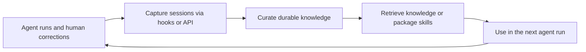

  

<h3 align="center">Help your agents learn from experience.</h3>

  Agents generate valuable experience every time they work: successful approaches,  
  failed attempts, and human corrections. Stash captures that history and makes  
  its lessons available to future runs.

  
  
  
  

This repository provides the open-source foundation: trace collection, persistent
knowledge, and reusable skills, accessible through a [Python SDK](sdk/README.md),
REST API, MCP, and CLI. It works alongside your existing agents and models.

```mermaid
flowchart LR
    A[Agent runs and human corrections] --> B[Capture sessions via hooks or API]
    B --> C[Curate durable knowledge]
    C --> D[Retrieve knowledge or package skills]
    D --> E[Use in the next agent run]
    E --> A
```

Stash's broader work focuses on extracting reliable feedback signals from messy
production traces and using them to improve prompts, skills, and ultimately
model weights. The [reward-model product docs](https://www.joinstash.ai/docs)
cover trace annotation, reward-model training, and skill optimization with GEPA;
those training and optimization implementations are not included in this
repository. Our research focuses on improving the reliability of feedback
extracted from production traces.

## Reward models in action

**Manual annotation is optional.** Use **Auto** mode to learn from traces
without manually labeling them. If you want to provide explicit feedback, you
can add ratings and comments yourself.

The [product demo](https://www.joinstash.ai/docs) below shows the optional
manual-annotation workflow for a refund-support agent, from reviewer feedback
to a reusable skill. These screenshots use demo traces; the displayed scores
are from that example run.

**1. Add feedback if desired, or use Auto mode.** For manual annotation, label a
trace or step, highlight the response, and explain the correction.

<!-- Frame from www/public/docs/demo/annotate.mp4 at 10 seconds. -->

  

**2. Train a reward model from trace feedback.** In the manual workflow shown
here, select examples with positive and negative labels to teach the model
what reviewers prefer.

<!-- Frame from www/public/docs/demo/train.mp4 at 3 seconds. -->

  

**3. Turn the reward signal into a skill.** GEPA uses the reward model and
reviewer comments to optimize instructions. Download the resulting `SKILL.md`
for your agent to use in future runs.

<!-- Frame from www/public/docs/demo/skill.mp4 at 20 seconds. -->

  

## How it works

1. **Capture experience.** Hooks for coding agents record prompts, tool calls,
   and responses when session recording is enabled. Use the SDK or API to send
   events from your own agents.
2. **Extract durable lessons.** A scheduled curator reads new sessions and
   source material, then updates linked pages in your Memory wiki. The knowledge
   stays available after the original session ends.
3. **Make lessons reusable.** Agents search and read that knowledge through the
   CLI, MCP, API, or virtual filesystem. You and your agents can package related
   instructions and files into a Skill: a folder containing a `SKILL.md`.
4. **Carry them into future runs.** Install skills into your agent with
   `stash skills install`. Installed skills auto-update at session start, so
   changes to shared instructions can reach the next run without changing the
   underlying model's weights.

### Example: a correction becomes a reusable instruction

Illustrative workflow:

| Stage | What happens |
|---|---|
| **Trace** | An agent proposes a database migration. The reviewer points out that it would discard existing customer data. |
| **Durable lesson** | Record the project rule: schema changes must migrate existing data forward. |
| **Reusable skill** | Package a migration checklist that requires a data migration and verification that existing records survive. |
| **Next run** | The agent loads the checklist while planning another schema change. Reviewers check whether it applied the lesson. |

The output is inspectable knowledge and instructions that another agent can
read, use, and revise. Whether they improve results should be checked on
subsequent tasks.

In an [internal experiment](https://henrydowling.com/agent-velocity.html), we
measured a **49% speedup** for long-running Claude Code instances using Stash.
See the experiment for its setup and results.
