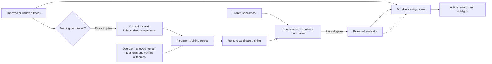

# Shared evaluator and learning loop

Stash maintains one released default evaluator, with versioned candidates and rollback.
Each model judges an assistant action in its task context, including tool choice and
arguments. Users do not need to train a personal model or write comments to get scores.
Personal models remain available under Advanced in the trace viewer.

This implements the learning and release infrastructure. It does **not** include a
pretrained shared checkpoint or establish that a model generalizes to arbitrary traces.
An operator must supply a reviewed benchmark, train remotely, inspect the results,
and release the first model. Until then, the UI explicitly says it is waiting for
the first release; imported traces remain queued.

## Lifecycle



An import/upsert transaction writes `rm_auto_scores`. The 30-second idle window
debounces live OTLP batches. Celery beat sweeps every 30 seconds and dispatches
saved-checkpoint inference to the reward queue. It scores only assistant responses
and tool calls; tool results, users and system messages are context. Each prefix
ends at the action being judged. Shared input version 2 includes system messages
and optional `metadata.evaluation_context` (task rubric/tool definitions known at
action time). Never put later outcomes in evaluation_context. Other metadata is
not model input. Tokenization currently retains the last 1024 tokens, so long
prefixes can lose early instructions; scores do not prove correctness.

The viewer selects the shared model by default, displays per-action credit and
timeline colors, polls active work and reports failures. The trace list shows mean
action credit and the number of scored actions for the current release. This mean
is separate from a personal model's whole-trace score. Credit is a bounded relative
preference, `tanh((raw_reward - training_mean)/(2*training_std))`, not a probability,
causal attribution or additive decomposition of outcome reward.

## Permission and evidence

Scoring a private trace never opts it into shared training. The trace owner must
enable `shared_training_allowed` explicitly through the checkbox or API. Comments,
step ratings and later user corrections can produce candidate action comparisons.
An independent LLM review checks alternatives against prior context; generated
comparisons are training-only. This is a separate judgment call, not a statistically
independent annotator or verified outcome. The current evaluator's rewards never
become their own training labels. Low-confidence, tied, unsupported or invalid
alternatives are excluded. Human trace-level ratings are not distributed over actions.

Every corpus row has provenance, permission reference, source trace when applicable,
task group, domain, agent, and a deduplication fingerprint. `metadata.domain` and
`metadata.agent` label automatically collected training slices. Corrections and
reimports invalidate old contributions and queue fresh extraction. Revoking
permission or deleting a trace removes its corpus rows; in-flight extraction cannot
restore them. Queued candidates with missing contributions fail, and publication
rechecks and locks the snapshot. Revocation excludes the data from future training;
it does not unlearn data from already released weights. Historical candidate
snapshots remain operator-only audit records.

## Fixed evaluation and release gates

Operators add structured comparisons from human review or verified outcomes with
permission evidence. They supply only context available before the proposed action.
Every task group is assigned permanently to training or evaluation; deleting a row
does not allow that task group to switch partitions. Exact duplicate alternatives
across partitions are rejected. Related tasks must use the same operator-assigned
group; semantic duplicate detection is not implemented.

Candidates train from the configured base model on all current training examples.
They do not warm-start from the incumbent, which avoids unknowingly carrying prior
training exposure into a newly curated benchmark. The frozen evaluation partition
never contributes gradients or reward normalization. Both candidate and incumbent
are scored against the candidate's exact benchmark snapshot.

The initial policy requires at least 20 evaluation pairs, 5 tool-call pairs, 5 task
groups, 2 domains and 2 agents, plus 5 pairs each from domains and agents absent from
training. Accuracy must be at least 75% overall and 60% in slices with at least 3
examples. A replacement must improve overall accuracy by at least 1 percentage
point, with no regression in any sufficiently populated action-type/domain/agent
slice. The release report stores counts, accuracies, policy, dataset hash, benchmark
IDs and incumbent ID. Promotion rejects stale baselines, changed policy, failed gates
or revoked examples. Rollback accepts only a previously released checkpoint and
creates a new audited release revision. Every release schedules all traces for rescoring.

These are minimum launch gates, not evidence of statistical significance or universal
quality. Operators should use substantially larger representative benchmarks, rotate
fresh held-out task groups, inspect disagreements, and raise thresholds as data grows.
Repeated selection on one benchmark can overfit the release process even though its
examples never receive gradients. Human/verified outcomes are ingested through the
operator API; this change does not execute customer tools or implement outcome replay.

## Operator bootstrap and recurring training

All controls below require `X-Admin-Token` and use `/api/v1/admin/rm`. Ordinary users
cannot read pooled examples, candidate details or shared weights. Release summaries
and scores on their own traces are the only cross-account access.

1. Deploy migrations through 0215, API, Celery beat and the reward worker with Modal,
   private S3 and Anthropic credentials described in [ROLLOUT.md](ROLLOUT.md).
2. Add reviewed train/eval examples with `POST /examples`. At least two training
   pairs are required to train; release requires the benchmark coverage above.
3. `POST /candidates` with `owner_user_id`, `name`, `base_model`, `epochs`. This
   snapshots the current corpus and queues **remote GPU training**, even if the
   personal-model runtime uses `RM_COMPUTE=local`.
4. Inspect `GET /candidates/{id}` (`status`, `metrics`, `release_report`), then
   `POST /candidates/{id}/promote` with `{"reason":"Reviewed bootstrap release"}`.
5. Optionally `PUT /automation` to enable recurring candidates and gated promotion:

```json
{
  "enabled": true,
  "owner_user_id": "<operator-user-uuid>",
  "base_model": "Qwen/Qwen3-0.6B",
  "epochs": 1,
  "min_new_examples": 100,
  "interval_hours": 24,
  "auto_promote": true
}
```

Automation defaults off. Enabling it authorizes recurring remote GPU jobs; setting
`auto_promote` authorizes releases that pass the gate. Disabling automation prevents
new jobs and automatic promotion but does not cancel an already running candidate.
The scheduler requires enough newly added training examples, a due interval and no
active candidate. Failed candidates do not loop forever on unchanged data; inspect
them and retry manually or contribute more data. `GET /automation` reports cadence,
last snapshot IDs, last attempt and scheduling errors. `GET /releases` lists the
release history; `POST /candidates/{id}/rollback` requires a reason.

Example corpus request (`POST /examples`):

```json
{
  "owner_user_id": "<operator-user-uuid>",
  "task_group": "order-1182",
  "domain": "support",
  "agent": "support-bot",
  "partition": "eval",
  "source": "human",
  "evidence": "Reviewer verified the action against the task and available tools",
  "permission_reference": "<approved dataset record>",
  "task_context": {"tools": [{"name": "lookup_order", "arguments": {"order_id": "string"}}]},
  "context": [{"role": "user", "content": "Find order 1182"}],
  "chosen": {"role": "assistant", "content": "", "tool_name": "lookup_order", "tool_input": {"order_id": "1182"}},
  "rejected": {"role": "assistant", "content": "", "tool_name": "lookup_order", "tool_input": {"order_id": "1183"}}
}
```

`GET /examples` supports limit/offset; `DELETE /examples/{id}` withdraws an example.
This example is documentation, not an instruction to contribute customer data.

## Recovery and limits

Scoring and collection have durable database work records, bounded automatic retries
(three), and interrupted-worker recovery. Queue broker outages leave queued work for
the next sweep. Reimporting a trace resets automatic scoring attempts; Score again
also allows an explicit retry. Shared candidate jobs permit three sequential Modal
invocations (train, candidate evaluation, incumbent evaluation), each capped at 20
minutes, under a 65-minute Celery hard limit. The sweep fails interrupted candidates
after 70 minutes. No production model training belongs on a developer laptop.

Tests cover tenant isolation, default scoring, consent/revocation races, broker
failure, candidate comparisons, failed/stale releases, rollback, scheduler cadence,
automatic promotion, and tiny offline CPU training/save/reload/evaluation. They
validate infrastructure, not the quality of a production evaluator.
